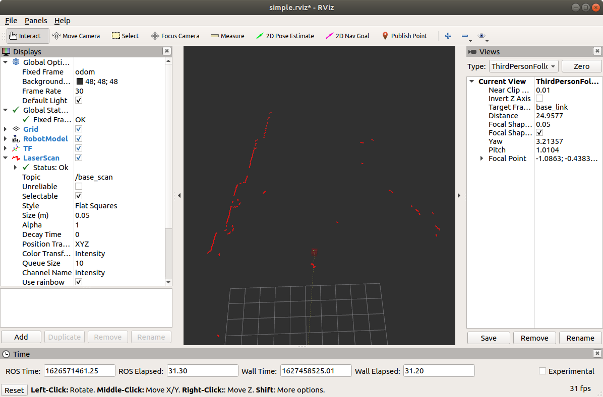
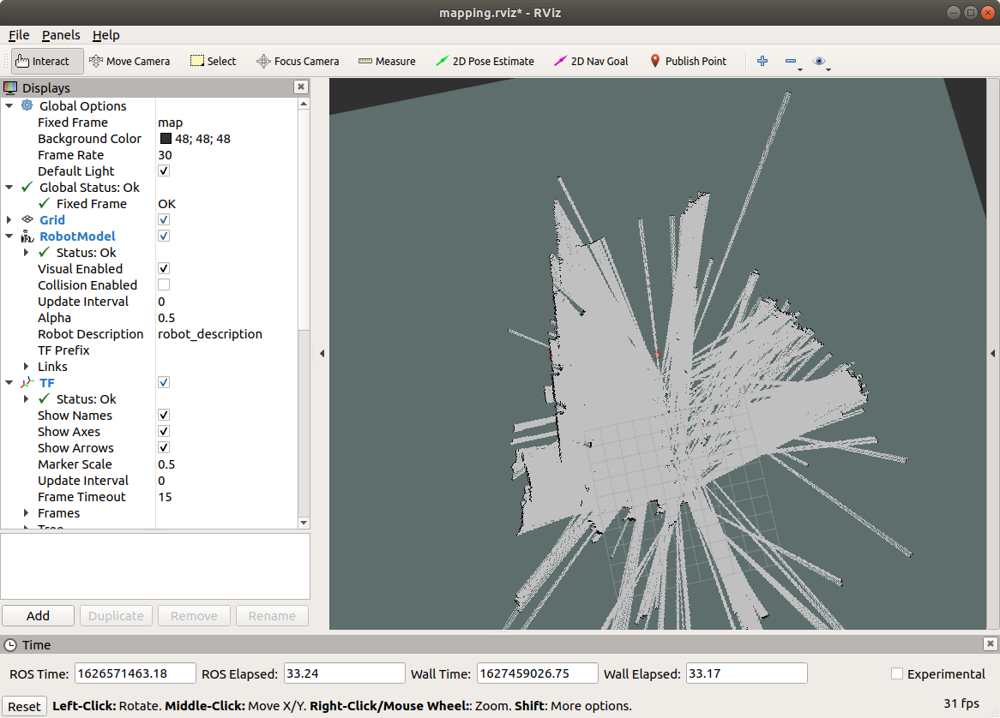

# Minibot v3

## 必要なソフト・ハード

```shell
$ sudo apt install ros-melodic-rplidar-ros 
$ sudo apt install ros-melodic-teleop-twist-keyboard
$ sudo apt install ros-melodic-key-teleop
$ sudo apt install ros-melodic-urg-node
$ sudo apt install xterm
```

- ZEDを使う、あるいはSVOファイルを再生する場合は[ZED関連ソフトのインストール](./README_ZED.md)も必要。 nVidia GPU搭載PC、もしくはJetsonでないと駆動できない。
  - [Getting Started with ROS and ZED](https://www.stereolabs.com/docs/ros/)

- テレオペや地図作成にはジョイスティックが必要。

## インストール

```shell
$ git clone https://github.com/KMiyawaki/oit_navigation_minibot_03.git
$ cd ~/catkin_ws && catkin_make
$ cp ~/catkin_ws/src/oit_navigation_minibot_03/desktop_scripts/*.sh ~/ # ホームディレクトリに起動用の各種スクリプトを配置
$ cd 
$ cat navigation.sh
#!/bin/bash
cd `rospack find oit_navigation_minibot_03`/launch/real
roslaunch navigation.launch map_name:=oit_hirakta_1gou1f_kaigi # ナビゲーション時に利用する地図名は編集の必要がある（後述）
$ cat navigation_rosbag.sh
#!/bin/bash
cd `rospack find oit_navigation_minibot_03`/launch/real
roslaunch navigation.launch map_name:=oit_hirakta_1gou1f_kaigi rosbag:=true # 同上
```

## ロボットの起動方法

上記インストール方法により、ホームディレクトリには次のロボット起動用スクリプト等が配置されるので、以下のコマンドによりファイルを確認すること。

```shell
$ cd
$ ls *.sh | grep -v stop
mapping.sh           # ジョイスティックでロボットを操作しながら地図を作成する。
mapping_rosbag.sh    # 同上。ただし、rosbagを同時に記録する。
navigation.sh        # 作成した地図でロボットを自律移動させる。
navigation_rosbag.sh # 同上。ただし、rosbagを同時に記録する。
teleop.sh            # ジョイスティックでロボットを操作する。
teleop_rosbag.sh     # 同上。ただし、rosbagを同時に記録する。
```

これらはロボットの起動スクリプトである。それぞれに[`rosbag`](https://qiita.com/srs/items/f6e2c36996e34bcc4d73)の記録ありとなしのバージョンがある。  
記録された`rosbag`は`~/.ros`ディレクトリに保存される。

```shell
$ ls stop_recording.sh 
stop_recording.sh    # rosbagの記録を停止する。
```

これは`rosbag`の記録を停止するスクリプトである。`rosbag`の記録ありのスクリプトを起動した場合は**必ずこのスクリプトを実行し、記録を停止してからもともとのスクリプトを終了させること**。

### テレオペの起動

ジョイスティックでロボットを操作する。LRF（Laser Range Finder）も起動する。ロボットの動作テストに用いる。  
下記２つのスクリプトのどちらかを起動する。

```shell
$ cd
# rosbag の記録あり
$ ./teleop_rosbag.sh
# rosbag の記録なし
$ ./teleop.sh
```

`rosbag`の記録ありを起動した場合、前項で記述した通りスクリプトを終了させる前に`stop_recording.sh`を必ず実行すること。  
具体的には新たなターミナルを開き、以下のコマンドを実行する。

```shell
$ cd
$ ./stop_recording.sh
```

その後、テレオペを終了する。具体的には`./teleop_rosbag.sh`もしくは`./teleop.sh`を起動したターミナルで`Ctrl+C`を押してスクリプトを終了させる。  
この起動時の手順は以降のスクリプトでも同様である。

### SLAMによる地図作成

ジョイスティックでロボットを操作しながらロボット周囲の環境の地図を作成する。

```shell
$ cd
# rosbag の記録あり
$ ./mapping_rosbag.sh
# rosbag の記録なし
$ ./mapping.sh
```

地図作成が終わったら、RVizや`./mapping_rosbag.sh`もしくは`./mapping.sh`を**絶対に終了させずに**別ターミナルで以下のコマンドを実行して地図を保存する。

```shell
$ roscd oit_navigation_minibot_03/maps
$ rosrun map_server map_saver -f test # test の部分は任意の地図名をつける。
[ INFO] [1615598383.151895509]: Waiting for the map
[ INFO] [1615598383.434767477]: Received a 480 X 736 map @ 0.050 m/pix
[ INFO] [1615598383.434929931]: Writing map occupancy data to sample_01.pgm
[ INFO] [1615598383.449962167]: Writing map occupancy data to sample_01.yaml
[ INFO] [1615598383.450234503]: Done
```

保存ができたら、RVizや`./mapping_rosbag.sh`もしくは`./mapping.sh`を終了させてよい。ただし、前述したように、`./mapping_rosbag.sh`の場合は事前に`stop_recording.sh`を実行しておかなければならない。  
その後地図ファイルの有無を確認する。

```shell
$ roscd oit_navigation_minibot_03/maps
$ ls
test.pgm  test.yaml
```

### ナビゲーション

前項で保存した地図を使いナビゲーション（自律移動）をする。  
まず、起動用スクリプトを編集し、ナビゲーションに使いたい地図の名前を入力しておく。  
ここで、地図の名前とは前項で保存した地図ファイル名から拡張子を取り除いたものである。

- 例：`test.pgm  test.yaml`の場合、地図名は`test`。

```shell
$ cd 
$ gedit navigation.sh # 任意のテキストエディタで開く。emacsでもOK。
#!/bin/bash
cd `rospack find oit_navigation_minibot_03`/launch/real
roslaunch navigation.launch map_name:=test # map_name:=以降の文字をナビゲーション時に利用する地図名に変更する。
$ gedit navigation_rosbag.sh # 任意のテキストエディタで開く。emacsでもOK。
#!/bin/bash
cd `rospack find oit_navigation_minibot_03`/launch/real
roslaunch navigation.launch map_name:=test rosbag:=true # 同上
```

自己位置推定、ゴール指定方法はこれまで通り。

## rosbagを使う

`rosbag`の記録ありのスクリプトを起動した場合は、ロボット操作中のセンサデータが`rosbag`ファイルに記録されている。スクリプト停止前に指示通り`stop_recording.sh`を実行していたならば、`~/.ros`ディレクトリに拡張子`bag`のファイルができているはずである。

```shell
$ cd ~/.ros
$ ls *.bag
2021-07-18-10-23-48.bag # ファイル名は rosbag を記録した日時によって変わる。
$ rosbag info ./2021-07-18-10-23-48.bag # http://wiki.ros.org/rosbag/Commandline
path:         ./2021-07-18-10-23-48.bag
version:      2.0
duration:     22:05s (1325s)
start:        Jul 18 2021 10:23:49.42 (1626571429.42)
end:          Jul 18 2021 10:45:54.61 (1626572754.61)
size:         16.3 MB
messages:     134007
compression:  bz2 [305/305 chunks; 6.38%]
uncompressed: 229.5 MB @ 177.3 KB/s
compressed:    14.7 MB @  11.3 KB/s (6.38%)
types:        geometry_msgs/Twist   [9f195f881246fdfa2798d1d3eebca84a]
              nav_msgs/Odometry     [cd5e73d190d741a2f92e81eda573aca7]
              sensor_msgs/LaserScan [90c7ef2dc6895d81024acba2ac42f369]
              tf2_msgs/TFMessage    [94810edda583a504dfda3829e70d7eec]
topics:       /base_scan   18047 msgs    : sensor_msgs/LaserScan
              /cmd_vel     36559 msgs    : geometry_msgs/Twist  
              /odom        26442 msgs    : nav_msgs/Odometry    
              /tf          52958 msgs    : tf2_msgs/TFMessage    (2 connections)
              /tf_static       1 msg     : tf2_msgs/TFMessage
```

ここで、拡張子`bag`のファイルが見当たらないとき、以下のコマンドを実行して拡張子`active`のファイルが存在した場合は`rosbag`の完全な記録に失敗している。

```shell
$ cd ~/.ros
$ ls *.active
2021-07-18-10-23-48.bag.active
```

原因は`stop_recording.sh`を実行していないか、実行後にロボットの起動スクリプトの停止が早すぎたかのいずれかである。`active`ファイルを完全な`bag`ファイルに変換することも不可能ではないが、時間がかかるので、あきらめてもう一度きちんと記録しなおすこと。

`bag`ファイルを再生するスクリプトはこのパッケージに用意してある。再生のために`bag`ファイルを移動させる。

```shell
$ cd ~/.ros
$ mv 2021-07-18-10-23-48.bag ~/catkin_ws/src/oit_navigation_minibot_03/bags # 当然、このロボットで採取した bag ファイルでないといけない。
```

### rosbagを再生する

以下のコマンドで、`bag`ファイルを再生する。

```shell
$ ./play_rosbag.sh ../bags/2021-07-18-10-23-48.bag
... logging to /home/miyawaki/.ros/log/2870ef18-ef78-11eb-ace6-a87eeaadf0a7/roslaunch-user-19115N-CLR-7031.log
Checking log directory for disk usage. This may take a while.
Press Ctrl-C to interrupt
Done checking log file disk usage. Usage is <1GB.

xacro: in-order processing became default in ROS Melodic. You can drop the option.
started roslaunch server http://user-19115N-CLR:34791/

SUMMARY
========

PARAMETERS
 * /robot_description: <?xml version="1....
```



再生は`Ctrl+C`で終了できる。

```shell
^C[playbag-3] killing on exit
[rviz-2] killing on exit
[rosout-1] killing on exit
[master] killing on exit
shutting down processing monitor...
... shutting down processing monitor complete
done
```

再生時に`rate:=数値`オプションをつけることで、早送り／スロー再生が可能である。

```shell
./play_rosbag.sh ../bags/2021-07-18-10-23-48.bag rate:=2 # 倍速。rate:=0.5 でスロー再生。
```

### rosbagから地図を作成する

以下のコマンドで`bag`ファイルを再生し、記録されたセンサデータから地図を作成する。

```shell
$ ./play_rosbag_gmapping.sh ../bags/2021-07-18-10-23-48.bag 
... logging to /home/miyawaki/.ros/log/5269cbfe-ef79-11eb-ace6-a87eeaadf0a7/roslaunch-user-19115N-CLR-8285.log
Checking log directory for disk usage. This may take a while.
Press Ctrl-C to interrupt
Done checking log file disk usage. Usage is <1GB.

xacro: in-order processing became default in ROS Melodic. You can drop the option.
started roslaunch server http://user-19115N-CLR:46557/

SUMMARY
========

PARAMETERS
 * /robot_description: <?xml version="1....
 * /rosdistro: melodic
```



前項同様、再生時に`rate:=数値`オプションをつけることで、早送り／スロー再生が可能である。ただし、あまりに早送りすぎると地図が歪む。停止方法も前項と同様である。

## 作成した地図をシミュレータで使う（編集中）

```shell
$ roscd oit_navigation_minibot_03/maps
$ ls test* # 地図のファイルを確認
test.pgm  test.yaml
$ ./make_simulation_world.sh test
Add black border into test.pgm... 
Generated test_border.png
$ ls test* # 地図とシミュレータのファイルを確認
test.pgm  test.world  test.yaml  test_border.png
$ roscd oit_navigation_minibot_03/launch/simulation
$ ./navigation.sh ../../maps/test.yaml # 任意の自作地図を指定する。
```
