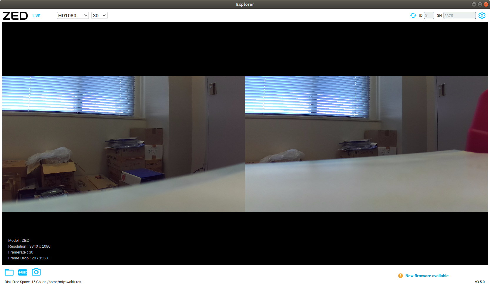

# ZED関連メモ

## SDK

[SDK Downloads](https://www.stereolabs.com/developers/release/) から自分の環境に適したファイルをダウンロードする。

- CUDAバージョンのチェックは下記コマンド

```shell
$ nvcc --version
nvcc: NVIDIA (R) Cuda compiler driver
Copyright (c) 2005-2020 NVIDIA Corporation
Built on Mon_Oct_12_20:09:46_PDT_2020
Cuda compilation tools, release 11.1, V11.1.105 # バージョン11.1
Build cuda_11.1.TC455_06.29190527_0
```

ダウンロードしたディレクトリで下記コマンドを実行し、SDKをインストールする。

```shell
$ ls ZED_SDK*
ZED_SDK_Ubuntu18_cuda11.1_v3.5.0.run
$ chmod u+x ZED_SDK_Ubuntu18_cuda11.1_v3.5.0.run 
$ ./ZED_SDK_Ubuntu18_cuda11.1_v3.5.0.run
```

ライセンスのテキストが表示されるので、一読し`q`キーで終了させる。

```shell
Verifying archive integrity...  100%   All good.
Uncompressing 'ZED camera SDK by Stereolabs'  100%  
Ubuntu version 18.04 detected. OK
To continue you have to accept the EULA. Accept  [Y/n] ?Y # 承諾する
Installing...
Installation path: /usr/local/zed
# 以降の質問はすべてEnterキーを押す。
ZED SDK installation complete !
```

古いSDKが入っていると動作に支障が出る場合がある。ZED SDKは対応するCUDAバージョンも細かく別れているので、CUDAに合わせてきちんとアップデートすること。

- [アンインストール](https://github.com/stereolabs/zed-examples/issues/333)

```shell
$ sudo rm -R /usr/local/zed/
```

## zed-ros-wrapper

これはZEDのカメラそのものをPCで駆動する場合だけでなく、単に`svo`ファイル（ZEDの画像データを保存する独自形式）をROS上で再生する場合も必須である。  
[zed-ros-wrapper](https://www.stereolabs.com/docs/ros/#zed-ros-wrapper)の指示に従いインストールすること。

## SVOファイルの録画

GUIならコマンドラインツール`ZED_Explorer`を使う。

```shell
$ ZED_Explorer
```



解像度やFPSを選択して録画ボタンを押す。デフォルトで`~/.ros`に保存される。

### 何故SVOにデータ保存するのか

他のセンサデータとともに`rosbag`に保存できればそれが一番良いが、`rosbag`の記録速度では画像や点群を完全に保存することができずフレーム落ちが多発する。

### SVOファイルの問題点

再生時に`rosbag`と時間同期して再生できない点である。

- [syncing SVO playback time with ROS sim time #207](https://github.com/stereolabs/zed-ros-wrapper/issues/207)

このため、`rosbag`と`SVO`の録画開始時間を完全に一致させるか、時間をずらして再生を開始するしかない。  
現在のところ、ずらす時間は目分量で決めるしかないと思われる。たとえ、`SVO`と`rosbag`の記録開始時間を完全一致させたとしても、`SVO`再生開始時に読み込む時間がかかるため`rosbag`と`SVO`の再生にズレが生じる。  
この時間のズレは実行環境によっても変わる可能性が高い。

### SVOファイルの情報取得

下記スクリプトで`SVO`ファイルの情報を表示できる。第一引数はSVOファイルの相対パスである。

```shell
$ ./svo_info.py ../zed/210718/HD2K_SN29662061_10-23-49.svo 
Reading SVO file: ../zed/210718/HD2K_SN29662061_10-23-49.svo
First image time: 2021-07-18 10:23:49.479000
First image size: 2208 x 1242

Distorsion factor of the right cam before calibration: [-4.18448001e-02  1.00173000e-02 -2.35154002e-05 -7.64076016e-04
 -4.67137014e-03].
Distorsion factor of the right cam after calibration: [0. 0. 0. 0. 0.].
Confidence threshold: 100
Depth min and max range values: 499.17462158203125, 20000.0
Resolution: 2208, 1242.
Camera FPS: 15.0
Frame count: 18790.
```
